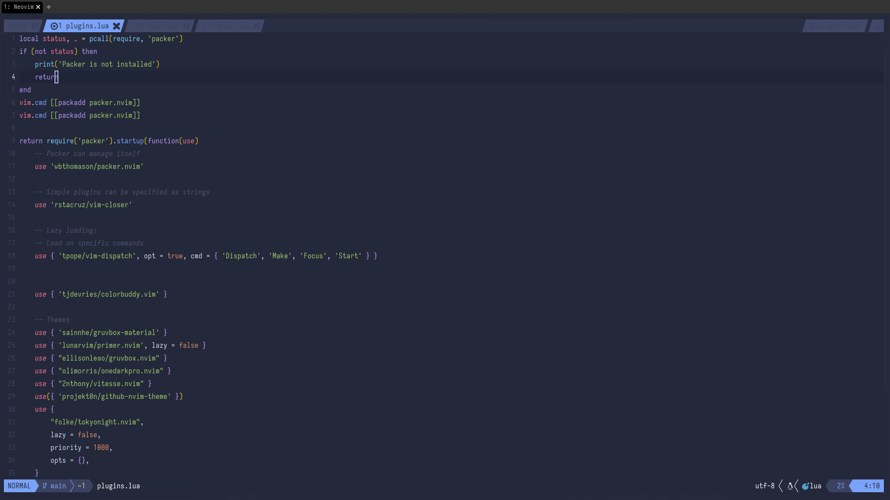

## NVIM: Configuration

> My personal neovim configuration files



### Wanna Clone 🛠️ ?

#### Backup Your Current Configuration
    mv ~/.config/nvim ~/.config/nvim.bak
    mv ~/.local/share/nvim ~/.local/share/nvim.bak


#### Clone

```shell
git clone https://github.com/somtodev/neovim-config ~/.config/nvim
```

#### Start Neovim

```shell
nvim
```
